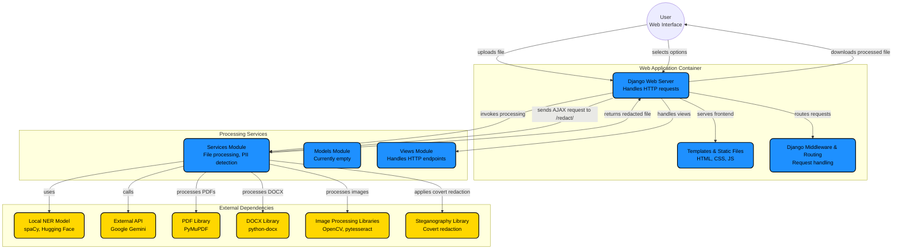

# Intelligent PII Redaction Tool

A powerful, AI-driven web application designed to automatically detect and redact Personally Identifiable Information (PII) from documents and images. Built with privacy and precision in mind, utilizing both local NLP models and Google's Gemini AI.


## Key Features

- **Dual AI Engines**:
    - **Local AI (Privacy-First)**: Uses Spacy and Hugging Face Transformers to detect PII accurately without data leaving your machine.
    - **Google Gemini Integration**: Leverages the power of Gemini 2.5 Flash for state-of-the-art context-aware PII detection.
- **Multi-Format Support**: seamlessly handles **PDF**, **DOCX**, **PNG**, **JPG**, and **JPEG** files.
- **Smart Redaction**:
    - **Visual Redaction**: Automatically draws black boxes over sensitive data in images and PDFs.
    - **Text Redaction**: Replaces text in documents with `[REDACTED]`.
- **Advanced ROI & OCR**: Uses OpenCV and Tesseract OCR to locate text and faces in images for precise redaction.
- **Watermarking System**:
    - Adds a customizable diagonal watermark to redacted documents.
    - **Smart Positioning**: Automatically centers and rotates watermarks for professional output.
- **Covert Redaction (Steganography)**: Option to hide the original PII data securely within the image files using steganography, while visually redacting it.
- **Metadata Cleaning**: Automatically wipes sensitive metadata (EXIF, Author info) from processed files.
- **Dark Mode**: Fully responsive UI with a sleek Dark/Light mode toggle.

## Technology Stack

- **Backend**: Django (Python)
- **Frontend**: HTML5, Tailwind CSS, JavaScript
- **AI/ML**: 
    - Google Generative AI (Gemini)
    - Spacy (NLP)
    - Hugging Face Transformers
- **Image Processing**: OpenCV, Pillow (PIL), Tesseract OCR
- **Document Handling**: PyMuPDF (Fitz), python-docx

## Project Structure

```
pii
│   Intelligent-PII-Redaction-Tool
    ├── pii_redactor_project
    │   ├── pii_redactor_project
    │   │   ├── __init__.py
    │   │   ├── asgi.py
    │   │   ├── settings.py
    │   │   ├── urls.py
    │   │   └── wsgi.py
    │   ├── redactor_app
    │   │   ├── migrations
    │   │   │   └── __init__.py
    │   │   ├── templates
    │   │   │   └── index.html
    │   │   ├── __init__.py
    │   │   ├── admin.py
    │   │   ├── apps.py
    │   │   ├── models.py
    │   │   ├── services.py
    │   │   ├── tests.py
    │   │   ├── urls.py
    │   │   └── views.py
    │   ├── db.sqlite3
    │   ├── manage.py
    │   ├── test_watermark.pdf
    │   └── test_watermark.png
```

## Architecture

Below is a high-level architecture diagram illustrating how the web app components interact (Mermaid):



## Installation & Setup

### Prerequisites
- Python 3.8+
- [Tesseract OCR](https://github.com/tesseract-ocr/tesseract) installed and added to system PATH.

### Steps

1.  **Clone the Repository**
    ```bash
    git clone https://github.com/yourusername/Intelligent-PII-Redaction-Tool.git
    cd Intelligent-PII-Redaction-Tool
    ```

2.  **Create a Virtual Environment**
    ```bash
    python -m venv venv
    # Windows
    venv\Scripts\activate
    # Mac/Linux
    source venv/bin/activate
    ```

3.  **Install Dependencies**
    ```bash
    pip install -r requirements.txt
    python -m spacy download en_core_web_sm
    ```

4.  **Configure Environment Variables**
    - Create `.env` in the project directory.
    - Add your Gemini API key:
      ```env
      GEMINI_API_KEY=your_actual_api_key_here
      ```

5.  **Run Migrations**
    ```bash
    python manage.py migrate
    ```

6.  **Start the Server**
    ```bash
    python manage.py runserver
    ```
    Access the tool at `http://127.0.0.1:8000/`.

## Usage Guide

1.  **Upload**: Drag & drop or select a file (PDF, Image, Doc).
2.  **Select Model**: Choose between **Local AI** (faster, offline) or **Google Gemini** (more powerful).
3.  **Choose PII Types**: Select specific entities to redact (Names, Emails, Phone Numbers, Aadhaar, PAN, etc.).
4.  **Options**:
    - **Wipe Metadata**: Removes hidden file info.
    - **Apply Watermark**: Adds a "REDACTED" overlay.
    - **Covert Redaction**: Hides data using steganography.
5.  **Redact**: Click the button and download your secured file!


